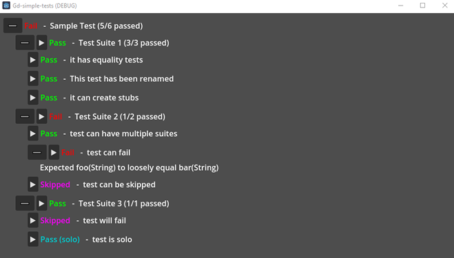

# Godot Simple Test

A very simple unit testing framework. 

It *doesn't* have any of the bells and whistles. Just the ability to run scenes as tests.




**why make this?**

I didn't want a very editor heavy plugin. I wanted something lightweight, simple and easy to just vomit. If you need a fully fleshed out 
Unit Testing Framework, try [GUT](https://github.com/bitwes/Gut) or [GdUnit4](https://github.com/MikeSchulze/gdUnit4)

## Setup
1. Import addon from asset store or download as zip then unpack at `addons/godot_simple_unit_test`
1. Activate plugin via `Project > Project Settings > Plugins > SimpleUnitTest - [] Enable`
1. **Create a new scene** that has `SimpleTest_Runner` node as root
1. **Create a new script** that extends `SimpleTest`
1. **Attach this new script** as a child node of the root (see screenshot above)
    * You can rename this node to be whatever you want
1. Write the test (see Writing a test below)
1. Run Scene

##  Writing A Test

- Tests must `extends SimpleTest` for it to be recognized
- Every function that starts with either `it` , `should` , or `test` will become a test case.

**Sample Test**
```gdscript
extends SimpleTest

func it_has_equality_tests():
  expect(true).to.equal(true)
  expect(true).to.NOT.equal(false)

  expect([1,2,3]).to.equal([1,2,3])
  expect([1,2,3]).to.NOT.strictly.equal([1,2,3])
  expect(1).equal(1, "Custom message at the end of every expect")
```


### Expect Functions
---------------------------------

We mostly do things the fluent way. The following keywords can be chained after
an `expect` statement.

| Chainable Keyword  | What |
| ------------- | -------------
| `to`  | Sugar only. Does nothing.
| `have`  | Sugar only. Does nothing.
| `been`  | Sugar only. Does nothing.
| `be`  | Sugar only. Does nothing.
| `IS`  | Sugar only. Does nothing.
| `are`  | Sugar only. Does nothing.
| `will`  | Sugar only. Does nothing.
| `NOT` | Inverts the results. Must be capitilized.
| `strictly`| Equality checks are replaced with `is_same()`

| Function Keyword  | What |
| ------------- | -------------
| `equal(Variant)` | Loosely compares the 2 values using `==`
| `truthy()` | Checks for truthiness using a ternary operator
| `falsey()` | Checks for falsiness using a ternary operator
| `called()` | Checks if a `stub` has been called atleast once
| `called_n_times(int)` | Checks if a `stub` has been called exactly `n` times


### Hooks

You can override these functions

| Func  | What |
| ------------- | -------------
| `_before():`  | Called once before any of the tests in the suite are begun
| `_before_each():`  | Called before each test
| `_after_each():`  | Called after each test
| `_after():`  | Called after all of the tests in the suite are done


### Test Utility Methods
---------------------------------

#### `expect(Variant)`

Pass down any value to perform assertions against.

#### `test_name(String)`

Rename the test to aynthing. By default the test name is the func name but cleaned

#### `stub()`

Creates a stub handler. You can call `stub().callable` to get the actual stub to pass around.

You can test stubs like this

```gdscript
func test_stub():
  var handler = stub()
  var cb = handler.callable

  cb() # Call function

  expect(handler).to.have.been.called()
```

### Additonal Test Controls

Inspired by the way GdUnit skips test, I've opted to follow a similar pattern for test controls.
#### `_skip`


Adding `_skip` to the parameter will skip that specific test case for that test suite.

_Note: This only works at a suite level. You cant skip whole suites yet..._

```gdscript
func it_will_be_skipped(_skip):
  pass
```

#### `_solo`

Adding `_solo` to the parameter will skip all other non-solo tests in that suite.

_Note: This only works at a suite level. You cant skip whole suites yet..._

```gdscript
func it_will_skip_others(_solo):
  pass
```

## Notes

If for some reason, you do decide to use this and need more expect funcs, just open an issue.